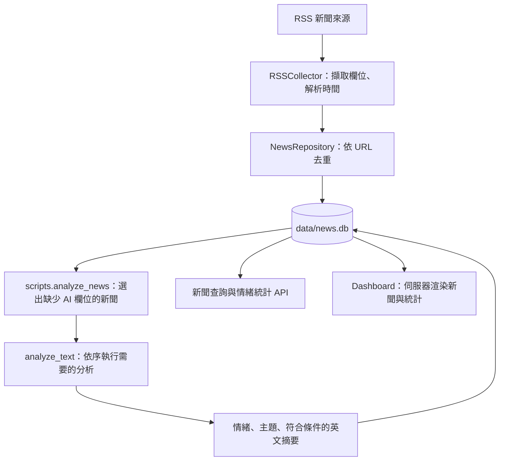
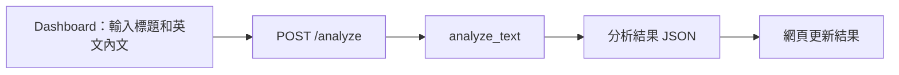

# AI Financial News Intelligence

## Gemini 標題分析原型

安裝 `python -m pip install -r requirements-gemini.txt`，在專案根目錄 `.env` 設定 `GEMINI_API_KEY`；可用 `GEMINI_MODEL` 覆寫預設 `gemini-3.8-flash`。`.env` 不提交，環境變數優先。

啟動 `python -m uvicorn src.api.main:app --reload`，到 `/check` 擷取／貼上、確認儲存文章，再按「前往標題分析」。也可直接到 `/paragraphs` 貼文，先預覽再按「使用 Gemini 分析標題」。按分析才會傳送標題與全文到 Google，可能產生 API 費用。

`POST /headline/analyze` 接收 `title`、`content`、`paragraph_mode` 與 `/articles/prepare` 產生的 `document_id`，也可帶 `article_id`（見下方）。第一版上限 20,000 字（不含空白，與 `/check` 同一算法）、400 段，不截斷。結果有四類判斷、主張、原因、證據 ID、原段落、模型／提示詞版本、时间與用量；以段落引用，尚未切句。缺金鑰、配額、逾時、格式或引用錯誤會明確失敗，不偽裝成資訊不足。

成功結果與輸入快照保存於 SQLite 新表 `headline_analyses`，不改寫原文章。相同輸入、模型、提示詞版本重用結果。單一程序同時只允許一筆分析；目前以本機單一 worker 運行，尚無跨 worker 去重或帳號。失敗不快取，不自動重試；內容或分段方式修改後須重新預覽。

### 分析端防護與紀錄

| 項目 | 行為 | 設定（環境變數） |
| --- | --- | --- |
| 每日分析上限 | 每個 UTC 日最多 N 次**新的**模型呼叫，超過回 429 `daily_limit`；已快取的結果不受影響。失敗的呼叫不計數（但可能已產生費用）。 | `HEADLINE_DAILY_LIMIT`，預設 50 |
| 請求頻率限制 | 每個來源位址每分鐘：`/articles/preview` 20 次、`/articles` 60 次、`/headline/analyze` 6 次；超過回 429 `rate_limited` 與 `Retry-After`。記憶體內、單一程序有效。 | `RATE_LIMIT_PREVIEW`、`RATE_LIMIT_CONFIRM`、`RATE_LIMIT_ANALYZE`；`0` 表示關閉 |
| 代理後的來源位址 | 預設用連線位址。只有放在自己控制的代理後面才可設為 `1`，否則 `X-Forwarded-For` 可被偽造。 | `TRUST_PROXY_HEADERS=1` |
| 說明不引入文章外資訊 | 模型的主張、說明、摘要裡的**數字與英文名稱**必須出現在標題或內文，否則整筆結果被拒絕（`ungrounded_output`，不快取）。只能擋數字與名稱，擋不了「只用文章裡的字卻下錯結論」。提示詞版本 `headline-paragraphs-v2`。 | — |

**關聯已確認文章**：從 `/check` 進入分析時，請求會帶 `article_id`。伺服器會確認送出的文字與那篇已存文章完全相同才建立關聯（否則 404 或 409），存在新表 `article_analyses`（不需要遷移舊表）。查詢某篇文章的所有分析：`GET /articles/{id}/analyses`。在分析頁手動修改文字後，關聯會自動取消。

**用量與耗時**：每筆分析記錄 `latency_ms` 與供應商回報的 token 用量。

```bash
python -m scripts.usage_report
python -m scripts.usage_report --input-price 0.30 --output-price 2.50
```

價格（每百萬 token）由你自己提供，程式不內建任何價格；只讀資料庫，不呼叫模型。

模型只比對本文，不做外部事實查核；引用存在不代表語意判斷正確，尚待人工評估。程式依據 [Google 結構化輸出文件](https://ai.google.dev/gemini-api/docs/generate-content/structured-output) 使用 REST JSON Schema，並於本機再次驗證。

測試：`python -m pytest tests -q`（使用模擬 Gemini，不耗用額度）。


財經新聞蒐集與 AI 分析原型。將 RSS 新聞存入 SQLite，使用情緒分析、主題分類與摘要模型整理資訊，再透過 FastAPI 與網頁 Dashboard 呈現。

另外提供「貼上英文新聞、即時分析」功能，方便直接體驗模型輸出。

> 本專案用於探索新聞資訊處理，不提供股價預測或投資建議。目前為開發中的原型；事件聚合仍是後續規劃。

## 標題照妖鏡：正文段落準備（新增）

接收 Max 提供的標題與完整**純文字**正文。此階段只整理段落，不擷取網址、不呼叫模型、不判斷標題，也不寫入新聞資料庫。

啟動 `python -m uvicorn src.api.main:app --reload` 後開啟 `/paragraphs`，可貼上文章、預覽 P001 等編號、點選高亮原段落並下載 JSON。舊 Dashboard 也提供入口。

`POST /articles/prepare` 接收：

```json
{"title":"公司全面漲價","content":"公司仍在評估。\n\n目前只涉及部分產品。","paragraph_mode":"blank_lines"}
```

- `blank_lines`（預設）：空白行分段，段落內單次換行保留，適合有折行的文字。
- `line_breaks`：每次換行分段，適合上游用單次換行連接段落的輸出。
- 不依標點切句、不改寫或截斷；沒有段落邊界就保留一整段。上游需保留換行。
- `original_text` 原樣保留；段落視圖只統一 CRLF/CR 換行、移除段落首尾空白，不修改內部數字、引號與標點。標題獨立保存。
- 空白輸入回傳 422；標題最多 2,000 字元、正文最多 200,000 字元，超限拒絕而非截斷。此限制不是模型 context window。
- `document_id` 由完整輸入、分段方式與處理版本計算；輸入變更後，舊引用不可沿用。
- 後續模型可接收完整 `paragraphs` 清單，不需逐段獨立分析；每個段落物件包含 `id` 與 `text`。

`src.processing.cleaner.resolve_evidence(article, document_id, paragraph_ids)` 會驗證版本與 ID，並從原段落取得引用文字。不存在的 ID 或版本不符會拒絕整個引用結果。這只驗證引用位置，不保證模型判斷正確。目前尚未串接模型結果 API，也未持久化此預覽資料；下載 JSON 可保存本次輸入。

新檔案：`src/api/paragraphs.py`（路由與 schemas）、`src/api/templates/paragraphs.html`、`src/api/static/paragraphs.js`、`src/api/static/paragraphs.css`；核心處理位於 `src/processing/cleaner.py`。

測試（不下載模型、不修改新聞 DB）：

```bash
python -m unittest tests.test_paragraphs -v
```

## 目錄

- [目前功能](#目前功能)
- [系統流程](#系統流程)
- [快速開始](#快速開始)
- [日常操作](#日常操作)
- [API 使用方式](#api-使用方式)
- [AI 分析邏輯](#ai-分析邏輯)
- [資料庫與設定](#資料庫與設定)
- [專案結構與檔案用途](#專案結構與檔案用途)
- [已知限制](#已知限制)
- [測試與部署現況](#測試與部署現況)
- [後續規劃](#後續規劃)

## 目前功能

| 功能 | 現況 |
| --- | --- |
| RSS 新聞蒐集 | 已實作；手動執行，包含 BBC Business 與 Yahoo 台灣國際財經來源 |
| 新聞入庫與 URL 去重 | 已實作；SQLite + SQLAlchemy |
| 情緒分析 | 已實作；FinBERT，輸出 positive / neutral / negative |
| 主題分類 | 已實作；BART-MNLI，從 8 個候選主題選取一類 |
| 英文摘要 | 已實作；DistilBART，符合條件才產生摘要 |
| 缺少欄位的批次補算 | 已實作；逐筆儲存，單篇失敗後繼續處理下一篇 |
| Dashboard | 統計卡、情緒圖表、最近 10 篇及全部新聞、互動分析表單 |
| 新聞查詢 API | 清單、單篇與情緒統計；清單支援來源、語言篩選 |
| 即時文字分析 API | 已實作；結果不入庫 |
| 自動排程、事件聚合、語意搜尋 | 尚未實作 |
| 自動化測試、CI | 尚未建立 |

新聞蒐集和批次分析目前由命令觸發。啟動網站不會自動抓取或分析新聞。

## 標題照妖鏡：文章輸入（開發中）

`/check` 是新的單篇檢查流程的入口，目前只完成到「輸入與確認」：貼上新聞網址 → 擷取標題與正文 → 正文不可用時顯示原因並改貼內文 → 預覽、可編輯並確認 → 存入 `articles` 資料表。切句、標題主張分析與結果畫面尚未實作。

| 路由 | 功能 |
| --- | --- |
| `GET /check` | 輸入頁面 |
| `POST /articles/preview` | 擷取一篇文章，不存檔；擷取失敗也回傳 200，以 `failure_reason` 說明原因 |
| `POST /articles` | 儲存使用者確認的標題與正文；相同輸入重複確認會沿用同一筆 |
| `GET /articles/{id}` | 讀回已確認的文章 |

- **支援來源**：只有 `src/ingestion/article_sources.py` 列出的網站（目前為 Yahoo奇摩新聞／股市）。新增來源前先確認使用條款與 robots.txt，並用真實文章測過擷取結果。
- **擷取限制**：只接受該來源網域的 http(s) 網址；每一次轉址與 robots.txt 都會重新檢查，網域須解析到公開位址；限制轉址次數、下載大小與總時間。實作細節與已知缺口見 `src/ingestion/article_fetcher.py` 開頭說明。
- **正文長度**：少於 100 字視為不可用；100～299 字可用但會警告；超過 20,000 字直接拒絕，不會截斷。
- **輸入方式**：儲存時標記為 `fetched`（未修改）、`fetched_edited`（擷取後編輯）或 `pasted`（手動貼上）。編輯後的內容是新的一筆，原本那筆不會被改寫。
- 啟動網站時會自動建立缺少的資料表（例如 `articles`），不會修改或刪除既有表。

## 系統流程

### 1. 蒐集、入庫、批次分析



批次流程只補算缺少的欄位。例如一篇新聞已有情緒和主題，只有摘要為空，就只嘗試產生摘要。

### 2. 貼上文字即時分析



這條流程不會寫入資料庫，也不會增加 Dashboard 的新聞總數。兩條流程共用 AI 分析邏輯。

## 快速開始

### 1. 準備 Python 環境

以下以 Python 3.11 為例，與目前 Dockerfile 的版本一致。這是建立統一環境的起點，並不代表所有作業系統與套件組合都已驗證。

```bash
git clone https://github.com/yanwei12/ai-financial-news-intelligence.git
cd ai-financial-news-intelligence
python3.11 -m venv .venv
```

macOS / Linux：

```bash
source .venv/bin/activate
```

Windows PowerShell（建立環境時可使用 `py -3.11 -m venv .venv`）：

```powershell
.\.venv\Scripts\Activate.ps1
```

如果本機已有虛擬環境，先確認它的 Python 版本與用途，避免直接覆蓋。

### 2. 安裝依賴

目前 `requirements.txt` 尚未列出 `torch` 與 `transformers`，因此需額外安裝：

```bash
python -m pip install --upgrade pip
python -m pip install -r requirements.txt
python -m pip install torch transformers
python -m pip check
```

安裝後確認主要套件可匯入：

```bash
python -c "import fastapi, sqlalchemy, feedparser, requests, jinja2, torch, transformers; print('Imports OK')"
```

`requirements.txt` 目前為 UTF-16，且套件版本只有部分固定；完整依賴鎖定仍待整理。上述指令是目前原始碼對應的安裝方式，尚未完成乾淨環境的端到端安裝驗證。若套件版本無法取得或不相容，需先修正依賴清單。

### 3. 建立資料表

在專案根目錄執行：

```bash
python -m src.database.database
```

這會建立 `data/news.db` 及缺少的資料表，不會刪除既有紀錄。它不是資料庫遷移工具，不會自動替舊表新增欄位。

### 4. 蒐集新聞

```bash
python -m src.database.repository
```

此入口會確認資料表存在、抓取設定的 RSS、跳過相同 URL，最後寫入資料庫。RSS 可用性與回傳數量取決於來源當時的狀態。

### 5. 執行 AI 分析

```bash
python -m scripts.analyze_news
```

第一次使用模型時需要連線下載權重。三個模型目前都使用 CPU，初次下載、載入及推論可能需要較長時間；模型會在同一個 Python 程序內快取，重啟程序後仍需重新載入。

### 6. 啟動網站

```bash
python -m uvicorn src.api.main:app --reload
```

- Dashboard：<http://127.0.0.1:8000/dashboard>
- Swagger API 文件：<http://127.0.0.1:8000/docs>
- OpenAPI 規格：<http://127.0.0.1:8000/openapi.json>

`--reload` 用於本機開發。根路徑 `/` 目前沒有自訂首頁，請開啟 `/dashboard`。

## 日常操作

所有指令均從專案根目錄、在已啟用的環境中執行。

| 目的 | 指令 | 是否修改新聞資料 |
| --- | --- | --- |
| 建立缺少的資料表 | `python -m src.database.database` | 建表，不刪既有資料 |
| 抓 RSS 並入庫 | `python -m src.database.repository` | 是，新增新聞 |
| 只抓 RSS 並列出預覽 | `python -m src.ingestion.rss_collector` | 否 |
| 補算 AI 欄位 | `python -m scripts.analyze_news` | 是 |
| 統計與最近 5 筆新聞 | `python -m scripts.news_stats` | 否 |
| 總數與最早 5 筆新聞 | `python check_database.py` | 否 |
| 啟動開發網站 | `python -m uvicorn src.api.main:app --reload` | 目前網站端點不寫入新聞 |

`scripts/clear_news.py` 是清空工具：執行 `python -m scripts.clear_news` 會直接刪除 `news` 表全部紀錄，沒有互動確認。它不是安裝或啟動步驟，使用前須自行備份資料。

## API 使用方式

### 路由總覽

| 方法 | 路徑 | 功能 |
| --- | --- | --- |
| GET | `/news` | 查詢新聞清單；可用 `source`、`language` 篩選 |
| GET | `/news/{news_id}` | 查詢單篇；不存在時回傳 404 |
| GET | `/analytics/sentiment` | 情緒統計 |
| POST | `/analyze` | 即時分析輸入文字，不存檔 |
| GET | `/dashboard` | HTML Dashboard |

### 查詢新聞

```bash
curl 'http://127.0.0.1:8000/news?language=en'
curl 'http://127.0.0.1:8000/news/1'
```

`source` 與 `language` 都是精確比對；可同時使用。來源名稱含空格時可使用：

```bash
curl --get 'http://127.0.0.1:8000/news' \
  --data-urlencode 'source=BBC Business' \
  --data-urlencode 'language=en'
```

清單依 `id` 由大到小排列，代表入庫順序，並非依發布時間排序。目前沒有分頁。

清單回傳欄位：`id`、`title`、`url`、`source`、`language`、`published_at`、`sentiment`、`sentiment_score`、`ai_model`、`analyzed_at`。

單篇除了上述欄位，還包含 `author`、`description`、`content`、`category`、`created_at`。

注意：目前清單不包含 `category` 或 `summary`；單篇也不包含 `summary`。資料庫雖有摘要，Dashboard 也能顯示，但查詢 API 的 schema 尚未提供該欄位。

### 取得情緒統計

```bash
curl 'http://127.0.0.1:8000/analytics/sentiment'
```

示意回應，實際數字由目前資料決定：

```json
{
  "total": 10,
  "analyzed": 8,
  "unanalyzed": 2,
  "positive": 3,
  "neutral": 4,
  "negative": 1,
  "average_score": 0.87
}
```

`analyzed` 表示 `sentiment` 非 NULL 的篇數，不代表三項 AI 任務均完成。`average_score` 是非 NULL 情緒分數的平均值，無資料時為 `null`；它不是人工驗證的模型準確率。

### 即時分析英文新聞

```bash
curl -X POST 'http://127.0.0.1:8000/analyze' \
  -H 'Content-Type: application/json' \
  -d '{
    "title": "Company reports higher revenue",
    "description": "The company reported higher quarterly revenue as demand increased. Management said operating profit also improved compared with the previous year."
  }'
```

| 輸入欄位 | 必填 | 說明 |
| --- | --- | --- |
| `title` | 是 | 不可為空白字串 |
| `description` | 否 | 情緒／分類的輸入之一，也是目前摘要的來源 |
| `content` | 否 | 情緒／分類的額外輸入；目前不會單獨用於摘要 |

回傳欄位為 `language`、`sentiment`、`sentiment_score`、`category`、`summary`。摘要不符合產生條件時為 `null`，模型輸出值不固定。

目前端點固定使用 `language="en"`，並不會自動辨識語言。網頁表單要求標題和內文，API 則只要求標題。空白標題回傳 400，缺欄位等 schema 驗證錯誤由 FastAPI 處理；模型載入或推論錯誤目前未完整轉換成統一的錯誤回應。

## AI 分析邏輯

| 任務 | 模型 | 實際行為 |
| --- | --- | --- |
| 情緒 | `ProsusAI/finbert` | 拼接標題、描述、內文；截斷至最多 512 tokens，回傳標籤與分數 |
| 主題 | `facebook/bart-large-mnli` | 對拼接文字做 zero-shot 分類，取分數最高的一類 |
| 摘要 | `sshleifer/distilbart-cnn-12-6` | 只摘要 description；先取最多 3,000 字元，再由 tokenizer 限制長度 |

主題候選：Markets、Economy、Companies、Banking、Technology、Cryptocurrency、Energy、Politics & Regulation。分類器有回傳分數，但目前協調層只保留分類名稱。

摘要須同時符合以下條件：

1. `language` 等於 `en`。
2. `description` 有內容。
3. 標題與描述至少有一個經簡單停用詞過濾後的英文詞彙重疊。

此檢查只是簡單規則，無法保證語意一致或摘要事實正確。

批次入口選取 `sentiment`、`category`、`summary` 任一欄位為 NULL 的新聞。成功處理後記錄 `ai_model` 與 `analyzed_at`；例外時 rollback 當篇並繼續。被跳過的摘要仍為 NULL，因此下次批次仍會選中該篇。分任務狀態與跳過原因尚未儲存。

## 資料庫與設定

實際資料庫位置是專案根目錄下的 `data/news.db`，由 `src/database/database.py` 依檔案位置計算，不受執行時工作目錄影響。

`News` 資料表主要欄位：

| 分組 | 欄位 |
| --- | --- |
| 識別 | `id`、`url`（唯一） |
| 原始新聞 | `title`、`source`、`language`、`author`、`published_at`、`description`、`content` |
| AI 結果 | `sentiment`、`sentiment_score`、`category`、`summary` |
| 紀錄資訊 | `created_at`、`ai_model`、`analyzed_at` |

- `data/*.db` 已被 Git 忽略；別台電腦 clone 後需重新初始化與蒐集，或使用自行備份的資料。
- 若看到根目錄 `news.db`，它不是目前程式設定的資料來源。
- `.env.example` 提供 `APP_ENV` 與 `DATABASE_URL` 範本，但目前程式未讀取它們；複製成 `.env` 不會改變資料庫位置。
- RSS 來源目前寫在 `repository.py` 和 `rss_collector.py` 的直接執行區塊，尚未集中管理。
- 修改 ORM 欄位後，`create_tables()` 不會自動遷移既有表；需另行規劃遷移，不能假設重跑建表即可。

## 專案結構與檔案用途

```text
ai-financial-news-intelligence/
├── README.md
├── requirements.txt
├── Dockerfile
├── .dockerignore
├── .gitignore
├── .env.example
├── check_database.py
├── data/
│   └── news.db                 # 本機資料，不進 Git
├── scripts/
│   ├── analyze_news.py         # 批次分析入口
│   ├── news_stats.py           # 統計工具
│   └── clear_news.py           # 清空工具
├── src/
│   ├── __init__.py
│   ├── ingestion/
│   │   ├── __init__.py
│   │   └── rss_collector.py
│   ├── database/
│   │   ├── __init__.py
│   │   ├── database.py
│   │   ├── models.py
│   │   └── repository.py
│   ├── processing/
│   │   ├── __init__.py
│   │   └── cleaner.py          # 尚未實作
│   ├── ai/
│   │   ├── __init__.py
│   │   ├── analyzer.py
│   │   ├── sentiment.py
│   │   ├── topic.py
│   │   └── summarizer.py
│   └── api/
│       ├── __init__.py
│       ├── main.py
│       ├── schemas.py
│       ├── templates/
│       │   └── dashboard.html
│       └── static/
│           └── style.css
└── tests/
    ├── __init__.py
    └── rebuild                # 手動操作筆記，非測試程式
```

| 檔案 | 責任 |
| --- | --- |
| `src/ingestion/rss_collector.py` | HTTP 取得 RSS，轉為統一 NewsItem；直接執行只預覽、不入庫 |
| `src/database/models.py` | 定義 News ORM 資料表 |
| `src/database/database.py` | 建立 engine、固定資料庫路徑、提供建表函式 |
| `src/database/repository.py` | URL 去重、存入新聞；直接執行時完成蒐集入庫 |
| `src/processing/cleaner.py` | 空的預留模組，尚未接入流程 |
| `src/ai/analyzer.py` | 共用分析協調層，組合文字並按旗標呼叫模型 |
| `src/ai/sentiment.py` | FinBERT 情緒分析及模型快取 |
| `src/ai/topic.py` | 主題候選與 BART-MNLI 分類 |
| `src/ai/summarizer.py` | 摘要前的一致性規則及 DistilBART 推論 |
| `scripts/analyze_news.py` | 讀取待分析紀錄、呼叫協調層、逐筆更新 |
| `scripts/news_stats.py` | CLI 統計與最近新聞 |
| `scripts/clear_news.py` | 一次刪除全部新聞紀錄 |
| `check_database.py` | 簡單查看資料總數及最早 5 筆 |
| `src/api/main.py` | 路由、Session、統計查詢與模板渲染 |
| `src/api/schemas.py` | API 請求與回應的 Pydantic 結構 |
| `src/api/templates/dashboard.html` | 頁面、新聞卡、Chart.js 圖表與內嵌互動 JavaScript |
| `src/api/static/style.css` | 網頁樣式、響應式排版及互動狀態 |
| 各目錄的 `__init__.py` | Python 套件標記，空檔不代表冗餘 |
| `tests/rebuild` | 手動安裝與重建筆記，含破壞性操作，不應整份直接執行 |
| `requirements.txt` | 相依套件清單，目前尚需補齊 AI 套件 |
| `.env.example` | 尚未接入程式的設定範本 |
| `.gitignore` | 控制 Git 忽略資料、環境與快取 |
| `Dockerfile`、`.dockerignore` | 容器建置、啟動與內容排除設定 |
| `README.md` | 專案概覽、操作方式及現況 |

建議閱讀順序：資料表 → RSS 蒐集 → 入庫 → AI 協調層 → 批次入口 → API → 回應結構 → Dashboard。需要模型細節時再閱讀三個模型模組。

`.venv/`、其他虛擬環境、`__pycache__/` 和 `.DS_Store` 是本機環境或產物，不屬於核心業務邏輯；`.git/` 則是版本歷史，不應當作快取刪除。

## 已知限制

| 類別 | 目前限制 |
| --- | --- |
| 中文處理 | 來源包含中文新聞，但情緒與分類尚未依語言分流；不能假設中文結果可靠 |
| 摘要狀態 | 跳過、失敗、待處理尚未明確區分；NULL 摘要會再次入選 |
| 文字輸入 | Dashboard 將同一段內文放進 description 和 content，協調層會重複拼接 |
| 品質評估 | 尚無人工標註評估集；信心分數不等於準確率 |
| 內容清洗 | 沒有專用 HTML 清洗實作；RSS 擷取不等於取得完整文章 |
| 資料量 | 列表與 Dashboard 讀取全部新聞，尚未分頁 |
| API 完整性 | 新聞查詢 schema 尚未輸出摘要；輸入長度及推論併發未完整限制 |
| 前端 | 模板有 Markdown 圍欄殘留；圖表與按鈕初始化共用腳本，圖表載入失敗可能影響分析操作 |
| 可維護性 | CLI/API 統計、兩份 RSS 來源設定和新聞卡片模板有重複 |
| 自動化 | 無排程、重試佇列、告警或完整自動化測試 |

## 測試與部署現況

文章輸入流程（擷取、儲存、`/check` 相關 API）有自動化測試，不需要網路，也不需要安裝 torch：

```bash
python -m pip install -r requirements-dev.txt
python -m pytest tests
```

其餘部分（RSS 蒐集、AI 分析、Dashboard）仍沒有自動化測試；`tests/rebuild` 是操作筆記。語法檢查或成功匯入套件，不能取代實際的 API、資料庫及模型測試。

手動驗證可以依序檢查：

1. 建表與 RSS 入庫成功；同一來源重跑不新增相同 URL。
2. 批次分析完成後，統計與資料欄位符合預期。
3. `/news`、不存在的新聞 ID、`/analytics/sentiment` 回應正確。
4. Dashboard 顯示資料，英文分析可回傳結果，空白輸入有提示。
5. 即時分析前後新聞總數不變。

Dockerfile 使用 `python:3.11-slim`，預設啟動 `src.api.main:app`。目前 Docker 尚未具備完整可重現的部署流程：依賴清單缺 AI 套件、沒有自動建表／蒐集步驟、未提供 volume 配置，`.dockerignore` 也未完整排除額外虛擬環境與本機資料。完成這些項目並驗證後，才能把 Docker 當作正式部署方式。

## 後續規劃

建議依以下順序推進；這些是待辦方向，不是已實作能力：

1. **可重現安裝**：補齊、統一依賴與 Python 環境，建立乾淨環境啟動驗證。
2. **處理正確性**：語言分流、輸入去重、逐任務狀態與錯誤原因、摘要欄位回傳。
3. **程式與文件整理**：集中 RSS 設定、共用統計函式、拆分模板與 JavaScript、整理操作筆記。
4. **評估與測試**：RSS fixture、SQLite 測試資料、mock 模型的 API 測試，以及人工新聞評估集。
5. **使用體驗**：分頁、日期／主題／情緒篩選、明確的分析狀態。
6. **事件聚合**：結合文字向量、時間與實體，將同一事件的不同報導聚合，再提供來源對照和事件摘要。
7. **部署與維運**：經驗證的 Docker 流程、資料持久化、排程、日誌與必要的存取控制。

專案目標是讓新聞更容易閱讀、追溯與整理；先確保目前分析可信、流程可重現，再擴充事件層級的資訊整合。
